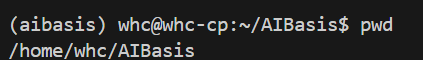

# 理解计算机中的路径概念

路径是计算机系统中至关重要的概念，它告诉系统如何找到文件或目录的位置。让我通过详细解释和一个Python代码示例来帮助你理解这些概念。

## 路径的基本概念

**路径**是指向文件系统中文件或目录位置的地址。就像现实世界中的地址指引你到达特定位置，计算机中的路径指引操作系统找到特定的文件或目录。

想象一下，如果计算机的文件系统是一栋大楼，那么：
- 文件夹就像是大楼里的房间
- 文件就像是放在房间里的物品
- 路径就像是说明如何从大楼入口到达特定房间的方向指南

## 路径的类型

### 绝对路径

**绝对路径**是从文件系统的根目录开始的完整路径。它提供了一个文件或目录的精确位置，不论你当前在文件系统中的哪个位置。

特点：
- 总是从根目录开始
- 在Windows中通常以盘符开始，如`C:\`
- 在Unix/Linux/macOS中以正斜杠`/`开始
- 包含从根到目标的完整路径

例如：
- Windows: `C:\Users\username\Documents\project\file.txt`
- Unix/Linux/macOS: `/home/username/Documents/project/file.txt`
- 
### 工作路径（工作目录）

**工作路径**（也称为工作目录或当前工作目录）是指用户或进程当前所处的目录。它是相对路径的参考点。

特点：
- 是系统当前操作的默认目录
- 如果使用相对路径，系统会以工作目录为起点
- 可以通过特定命令查看或改变（如`pwd`查看，`cd`改变）

例如下面显示的就是当前工作目录为`/home/whc/AIBasis`：


### 相对路径

**相对路径**是相对于当前工作目录的路径。它不是从根目录开始，而是从你当前所在的位置开始。

特点：
- 不以根目录符号开始
- 路径是相对于当前位置计算的
- 更简短，但依赖于当前的上下文

例如，如果当前在`/home/username/Documents`目录：
- 相对路径`./project/file.txt`指向的是`/home/username/Documents/project/file.txt`
- 相对路径`../Downloads`指向的是`/home/username/Downloads`


## 路径中的特殊符号

在使用路径时，有一些特殊符号具有特定的含义：

- `.`（单点）：表示当前目录
- `..`（双点）：表示上一级目录（父目录），比如相对路径中的例子`../Downloads`
- `~`（波浪号）：在Unix/Linux/macOS中表示用户的主目录，比如上面图中`~/AIBasis`表示用户`whc`的主目录下的`AIBasis`目录。

## Python中的路径示例

让我们通过一个Python代码示例来理解路径的作用：

```python
import os
import sys

# 打印当前工作目录（绝对路径）
print("当前工作目录:", os.getcwd())

# 假设我们有一个名为"data.txt"的文件在当前目录
# 使用相对路径打开文件
try:
    with open("data.txt", "r") as file:
        content = file.read()
        print("使用相对路径读取文件内容:", content[:50] + "...")
except FileNotFoundError:
    print("文件未找到（使用相对路径）")

# 使用绝对路径打开同一个文件
try:
    absolute_path = os.path.join(os.getcwd(), "data.txt")
    with open(absolute_path, "r") as file:
        content = file.read()
        print("使用绝对路径读取文件内容:", content[:50] + "...")
except FileNotFoundError:
    print("文件未找到（使用绝对路径）")

# 打印Python解释器的路径
print("Python解释器路径:", sys.executable)

# 打印当前脚本的路径
print("当前脚本的绝对路径:", os.path.abspath(__file__))

# 获取当前脚本所在的目录
script_dir = os.path.dirname(os.path.abspath(__file__))
print("脚本所在目录:", script_dir)

# 使用相对于脚本目录的路径
try:
    config_path = os.path.join(script_dir, "config.ini")
    with open(config_path, "r") as file:
        content = file.read()
        print("配置文件内容:", content[:50] + "...")
except FileNotFoundError:
    print("配置文件未找到")

# 访问上一级目录中的文件
try:
    parent_dir = os.path.dirname(script_dir)
    parent_file = os.path.join(parent_dir, "parent_data.txt")
    with open(parent_file, "r") as file:
        content = file.read()
        print("父目录文件内容:", content[:50] + "...")
except FileNotFoundError:
    print("父目录文件未找到")
```

## 路径在Python中的实际应用

当你运行Python脚本时，路径的概念变得尤为重要。让我为你详细解释这个过程：

### 1. 脚本执行时的工作目录

当你执行Python脚本时，工作目录默认是你执行命令的目录，而不是脚本所在的目录。这是一个常见的混淆点。

例如，如果你的脚本位于`/home/username/projects/script.py`，但你在`/home/username`目录下执行命令`python projects/script.py`，则工作目录是`/home/username`，而不是`/home/username/projects`。如果你执行命令`python script.py`，则会提示找不到脚本`No such file or directory`，但其实并不是没有这个.py文件，而是路径错了。

### 2. 路径对文件操作的影响

这种工作目录的机制会影响脚本中的文件操作：

- 如果使用相对路径（如`open("data.txt")`），Python会在当前工作目录中查找该文件。
- 如果使用绝对路径（如`open("/home/username/projects/data.txt")`），则不论工作目录是什么，Python都会在指定的确切位置查找该文件。

### 3. 解决脚本和数据文件分离的问题

一个常见问题是：如何确保脚本总是能找到它需要的数据文件，即使从不同的目录执行？

解决方案是使用脚本自身的位置作为参考点，而不是依赖工作目录：

```python
import os

# 获取脚本所在目录的绝对路径
script_dir = os.path.dirname(os.path.abspath(__file__))

# 构建数据文件的路径（相对于脚本目录）
data_file_path = os.path.join(script_dir, "data.txt")

# 现在可以安全地打开文件，不论从哪里执行脚本
with open(data_file_path, "r") as file:
    content = file.read()
```

这种方法确保了即使你从任何目录执行脚本，它仍然能找到相对于自身位置的数据文件。

## 为什么路径如此重要？

理解路径的工作原理至关重要，因为：

1. **可移植性**：使用相对路径可以让你的代码在不同系统间更容易移植，因为绝对路径在不同机器上通常不同。

2. **模块化**：正确处理路径使你能够组织代码和数据，创建模块化的应用程序。

3. **数据访问**：大多数程序需要读取或写入文件，路径是告诉程序在哪里找到这些文件的方式。

4. **错误预防**：许多运行时错误（如`FileNotFoundError`）是由路径问题引起的。理解路径可以帮助你预防和诊断这些问题。

## 结论

路径是计算机世界中的"地址系统"，掌握它们的工作原理对于编程至关重要，特别是在处理文件操作时。绝对路径提供了精确但不灵活的位置，而相对路径提供了灵活但上下文相关的位置。在开发中，明智地选择路径类型并正确管理工作目录可以让你的程序更加健壮和可维护。

当你运行Python代码时，正确处理路径可以确保你的程序能够可靠地找到它需要的所有文件，无论是配置文件、数据文件还是其他资源。