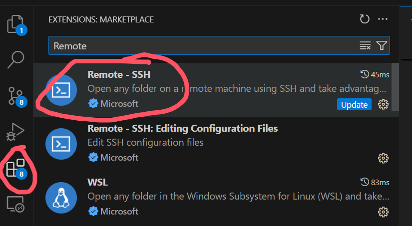
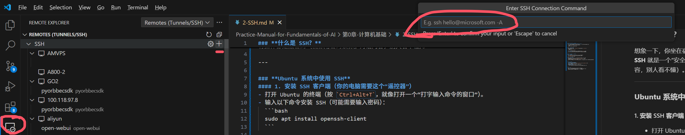

# **什么是 SSH？**
想象一下，你坐在宿舍里，想用你自己的电脑控制实验室的另一台电脑（比如运行代码或者传文件）。  
**SSH** 就是一个“安全遥控器”，它能让你通过命令行（类似打字输入指令的方式）远程操作另一台电脑，而且所有操作都是加密的（就像用密码锁保护对话内容，别人看不懂）。

---

# **Ubuntu 系统中使用 SSH**
## 1. 安装 SSH 客户端（你的电脑需要这个“遥控器”）
- 打开 Ubuntu 的终端（按 `Ctrl+Alt+T`，就像打开一个“打字输入命令的窗口”）。
- 输入以下命令安装 SSH（可能需要输入密码）：
  ```bash
  sudo apt install openssh-client
  ```

## 2. 连接到远程电脑
- 假设远程电脑的IP地址是 `192.168.1.100`，你的用户名是 `ai_user`。
- 在终端输入：
  ```bash
  ssh ai_user@192.168.1.100
  ```
- **第一次连接**时可能会问“是否信任这台电脑？”，输入 `yes` 回车。
- 然后输入密码（输入时看不到字符，正常现象），回车后就连接成功了！

---

# **在 VS Code 中使用 SSH**
## 1. 安装插件
- 打开 VS Code，点击左侧的「扩展」图标（四个小方块）。
- 搜索 `Remote - SSH`，安装微软官方提供的这个插件。
- 
- 
## 2. 连接远程电脑
- 安装后，VS Code 左侧会多一个小电脑，点它。再点齿轮左侧的加号。
- 输入命令（格式和终端一样）：`ai_user@192.168.1.100` → 回车。
- 选择保存配置（选第一个 `Linux`）。
- 输入密码，连接成功后，VS Code 的窗口就变成操作远程电脑了！可以像平时一样写代码、管理文件。

---

# **常见疑问**
- **如何知道远程电脑的地址？**  
  通常是老师或管理员告诉你的（比如 `192.168.1.100` 或 `example.com`）。
- **密码是什么？**  
  你的账号密码（比如学校给你的服务器账号密码）。
- **连不上怎么办？**  
  检查网络是否通畅，或者确认地址/用户名是否正确（比如大小写敏感）。

---

# **总结**
- SSH = 安全远程控制工具（用命令行操作另一台电脑）。
- Ubuntu 中直接用终端输入命令，VS Code 中通过插件操作（更直观）。
- 核心步骤：安装工具 → 输入地址和密码 → 开始远程操作！

---
如果厌烦了每次连接都要输入密码，可以搜一下“ssh免密登录”的方法。
通过配置密钥登录。