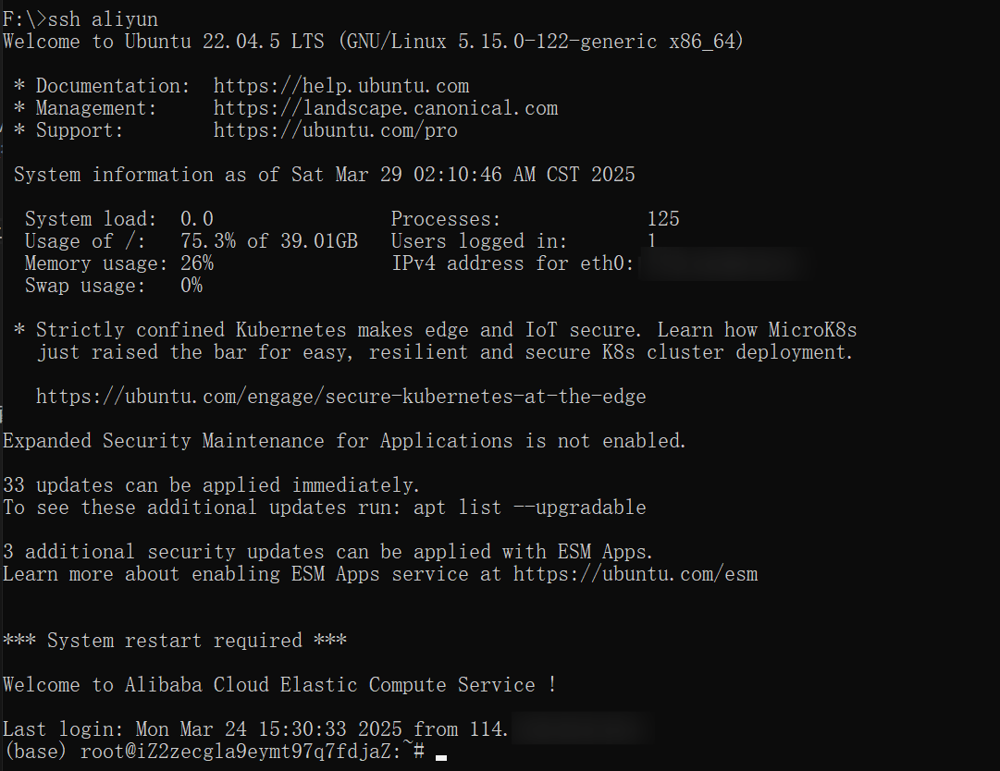
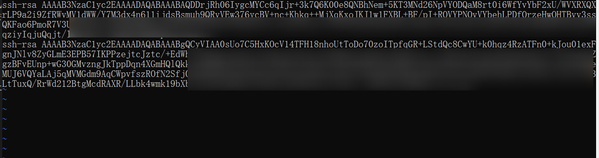

### 一、租用云服务器
1. **选择云服务商**  
   推荐阿里云、腾讯云、AWS 等主流平台，学生可通过教育优惠（如阿里云“飞天计划”、腾讯云“校园计划”）获取低价或免费服务器资源。
   也可以使用小服务商的服务器，比如autodl、智星云等等，比上面大厂便宜很多

2. **配置服务器参数**  
   - **操作系统**：选择 Linux 发行版（如 Ubuntu、CentOS），适合开发环境。一般来说深度学习大家普遍选择次新的版本UBuntu 22.04
   - **安全组规则**：开放 SSH 端口（默认 22），若需自定义端口需同步修改安全组规则。
   - **密钥对/密码登录**：建议生成 SSH 密钥对（更安全），或设置密码登录（更简单）。

3. **获取服务器信息**  
   租用后记录以下信息：服务器公网 IP、SSH 端口、用户名（如 `root` 或自定义用户）及密钥文件路径（或密码）。
   

---

### 二、配置本地 SSH 连接
1. **生成 SSH 密钥对（免密登录）**  
   - 本地终端执行 `ssh-keygen -t rsa`，默认生成 `id_rsa`（私钥）和 `id_rsa.pub`（公钥）。
   - 放着备用。生成的一般会在`C:\Users\xxxx\.ssh`(Windows) 或者`/User/xxx/.ssh`(MacOS)

2. **测试 SSH 连接**  
   打开一个终端，输入
   ```bash
   ssh user@server_ip -p port
   ```
   这里的user和server_ip是服务器后台查看的，有可能user是`user`也有可能是`root`，又或者是其他任意。server_ip有时候是一个IP地址，有时候是一个域名。注意，一般port是22（缺省的情况下），如果服务商给你一个新端口，那么需要显式用-p进行指定。
   记得输入密码。

   成功登陆会显示如下图片：
   
3. **放入密钥**（optional）
   当你上一步成功连接到一个服务器之后，你打开的终端会变成远程服务器的终端。你输入的指令就是在远程服务器上执行，而不是本地机器。
   此时，输入以下指令进入主目录的.ssh文件夹
   ```bash
   cd ~/.ssh
   ```
   然后用vim打开一个authorized_keys文件（如果没有则会创建）
   ```bash
   vim authorized_keys
   ```

   按一下`i`，进入vim的编辑模式。把刚刚第一步中的`id_rsa.pub`复制粘贴进去。
   大概会是以下这个样子（图中放入了2个pub公钥）：
   

   然后按一下`ESC`，退出编辑模式。再按一下`:`，进入vim命令模式，然后输入`wq`，按回车，保存并退出。见下图。
    

    放入密钥的好处在于之后登录不需要输入密码，很方便也很安全。同时可以在远程服务器中关闭密码登录，以提高安全性，防止被密码爆破。

### 三、使用 VSCode 连接服务器
1. **安装插件**  
   在 VSCode 扩展商店搜索并安装 **Remote - SSH**（官方插件，支持远程开发）。

2. **配置 SSH 连接**  
   - 按左侧的小电脑标记，然后点`+`，会出现一个输入框，把`ssh user@server_ip -p port`输入进去，并回车。此时会在左侧出现一个小电脑。按下图小三角形点击，就可以开启一个连接。
   - 
   - 
   - 我们也可以按`+`旁边的齿轮，查看并编辑配置文件（类似下方的），可以手动添加id_rsa密钥的路径：  
     ```
     Host my_server  # 自定义名称
       HostName server_ip
       User user_name
       Port 22
       IdentityFile ~/.ssh/id_rsa  # 若使用密钥登录
     ```
   - 第一次连接的时候，可能会让你选择一些选项，一般而言，会选择`Linux`、`Continue`这两个。


3. **操作远程文件**  
   - 通过 **File → Open Folder** 打开服务器目录，支持本地化编辑、调试和运行代码。
   - 拖拽本地文件到 VSCode 资源管理器可直接上传，右键文件可下载到本地。
   - 写代码、运行代码，跟本地几乎无区别。

---

### 四、常见问题解决
1. **连接频繁断开**  
   修改服务器 SSH 配置（`/etc/ssh/sshd_config`），添加以下参数并重启服务：  
   ```
   ClientAliveInterval 60  # 每 60 秒发送保活信号
   ClientAliveCountMax 3   # 允许 3 次无响应
   ```

2. **离线安装 VSCode Server**  
   - 本地下载对应版本的 `vscode-server-linux-x64.tar.gz` 和 `vscode_cli_alpine_x64_cli.tar.gz`，通过 SCP 传输至服务器并解压到指定目录。
   - 具体路径和版本号需根据 VSCode 的 Commit ID 调整（通过 **Help → About** 查看）。

3. **扩展安装失败**  
   部分插件需在远程服务器端安装。若服务器无法联网，可下载 `.vsix` 文件后通过 **Extensions → Install from VSIX** 手动安装。

---

### 五、安全与优化建议
- **修改默认 SSH 端口**：减少暴力破解风险。
- **禁用 root 登录**：创建普通用户并通过 `sudo` 提权。
- **使用跳板机（外网访问）**：通过中转服务器配置多级 SSH 连接（需在 `config` 文件中添加 `ProxyJump` 参数）。
  