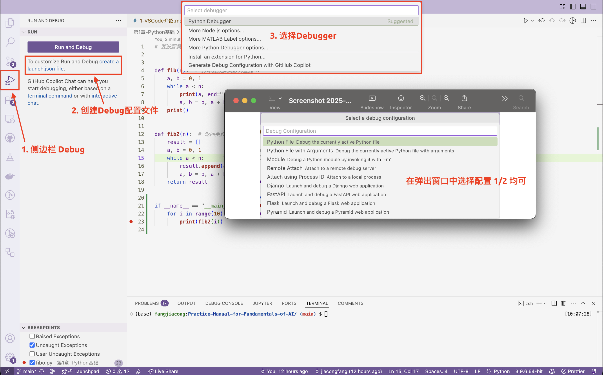
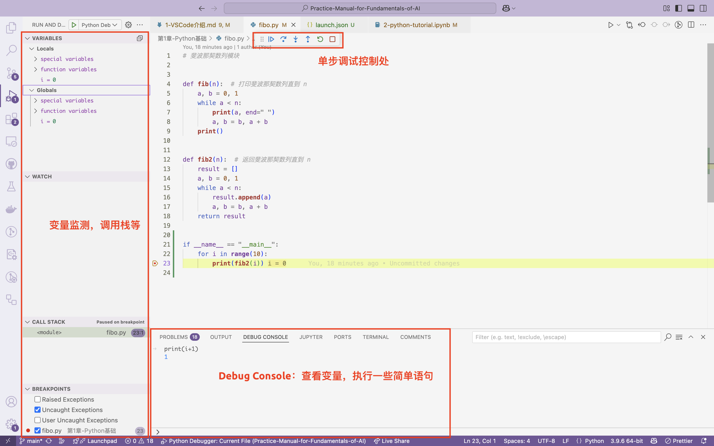
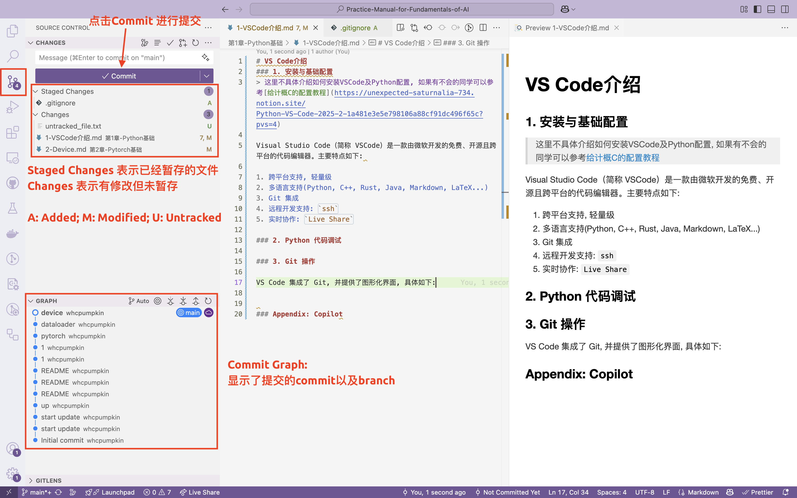

# VS Code介绍
### 1. 安装与基础配置
> 这里不具体介绍如何安装VSCode及Python配置, 如果有不会的同学可以参考[给计概C的配置教程](https://unexpected-saturnalia-734.notion.site/Python-VS-Code-2025-2-1a481e3e5e798106a88cf91dc496f65c?pvs=4)

Visual Studio Code（简称 VSCode）是一款由微软开发的免费、开源且跨平台的代码编辑器。主要特点如下: 

1. 跨平台支持, 轻量级
2. 多语言支持(Python, C++, Rust, Java, Markdown, LaTeX...)
3. Git 集成 (见下)
4. 远程开发支持: `ssh` (第0章已介绍)
5. 实时协作: `Live Share`

### 2. Python 代码调试

和 cpp 类似, 我们同样可以在 VS Code 中进行逐点调试, 官方给出了[很详细的教程](https://code.visualstudio.com/docs/python/debugging#_initialize-configurations) 这里做一些简单的介绍。

而后会在当前工作区根目录中生成一个`.vscode`文件夹, 里面有一个`launch.json`文件, 存放着调试配置, 初始化如下:

```json
{
    // Use IntelliSense to learn about possible attributes.
    // Hover to view descriptions of existing attributes.
    // For more information, visit: https://go.microsoft.com/fwlink/?linkid=830387
    "version": "0.2.0",
    "configurations": [

        {
            "name": "Python Debugger: Current File", // 配置名称
            "type": "debugpy", // 调试器类型
            "request": "launch", // 请求类型
            "program": "${file}", // 调试的文件: 当前文件
            "console": "integratedTerminal" // 控制台类型
        }
    ]
}
```

在后续学习中你可能想要在调试过程中传入一些参数, 那么相应的修改`launch.json`文件即可, 下面是一个例子:

```json
 {
     "name": "Python Debugger: startup.py",
     "type": "debugpy",
     "request": "launch",
     "program": "${workspaceFolder}/startup.py", // 当前工作区的startup.py文件
     "args" : ["--port", "1593"] // 在运行时传入 python 的参数
     // 相当于在终端中输入 python startup.py --port 1593
 },

```

而后你就可以在 VS Code 中进行逐点调试了, 操作比较简单, 不在此赘述. 值得一提的是在调试时, 你可以实时调整断点, 且可以通过 Debug Console 查看变量的值, 以及执行一些简单的 Python 代码.



> 类似Cpp/C中的 gdb, python也提供了类似的调试工具, 例如`pdb`和`ipdb`, 由于个人使用不多, 这里放一个简单教程供感兴趣的同学参考: [Better Python Debugging With IPDB](https://hasil-sharma.github.io/2017-05-13-python-ipdb/) 

```python 
import ipdb
ipdb.set_trace()
```


### 3. Git 操作

VS Code 集成了 Git, 并提供了图形化界面, 具体如下:

详细操作可以参考[官方文档](https://code.visualstudio.com/docs/sourcecontrol/intro-to-git), 建议可以从一个大作业中开始尝试使用 Git 进行版本控制。

### Appendix: GitHub Copilot
GitHub Copilot 是由 GitHub 提供的基于 GPT-4o 的代码助手, 提供了智能代码补全、代码片段, 以及代码建议等功能. 详细介绍可以参考 [GitHub Copilot](https://github.com/features/copilot). 可以通过教育邮箱或学信网认证获得 [GitHub Education Pack](https://education.github.com/pack), 从而免费使用 GitHub Copilot. 

