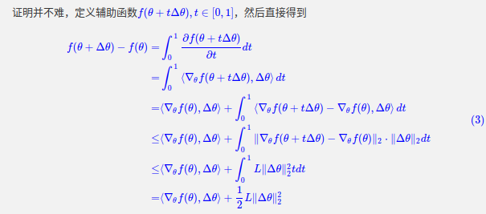

## 三、为什么要使用Batch Normalization？

**注明：以下关于数学公式推导来自于苏剑林的博客：https://kexue.fm/archives/6992**
本人复制了苏剑林博客的大部分推导内容，添加了一些自己理解的注释和不等式推导细节。本讲稿仅用于教育目的。

一个简单的例子。假设我们需要使用一个北京大学学生的身高（米）、体重（千克）、肺活量（毫升）这三个指标预测这个人的体测分数（百分制）。

我们都知道，这个是一个回归的问题。但是问题在于，大部分人身高的范围是在1.5-2米，体重在40-100千克之间，肺活量的范围在2000-6000毫升之间。这些数值的范围差异非常大，数量级上有显著的差异。直觉告诉我们，这样做似乎不太好。

感觉上，这些输入最好都是同一个数量级的数字，比如我们可以把体重除以10，肺活量除以1000，然后再去预测。既然如此，为什么不直接把这些数，变成一个均值为0，方差为1的分布呢？但是到这里，我们还是不知道为什么要这样做，只是直觉上觉得这样做会好一些。

我们接下来开始进入苏剑林的博客，探讨一下为什么要使用Batch Normalization。

### 1. Lipschitz约束

什么是Lipschitz约束？ 我们称，若函数$f(x)$在点$x_0$附近的某个邻域内存在一个常数L，使得对任意的$x_1$和$x_2$，有$|f(x_1)-f(x_2)|\leq L|x_1-x_2|$，则称函数$f(x)$在邻域内满足Lipschitz约束。

我们先假设有一个函数$f(\theta)$（具体来说，是一个损失函数），它是一个非线性函数，它的梯度满足Lipschitz约束：

$\|\nabla_{\theta} f(\theta+\Delta\theta) - \nabla_{\theta} f(\theta)\|_2 \leq L \|\Delta\theta\|_2——————(2)$

其中，$\Delta\theta$是一个很小的扰动，$L$是一个常数。

> 在这里我们忽略为什么$f(\theta)$可以被认为其梯度（近似）满足Lipschitz约束。

我们可以根据(1)得到一个不等式

$f(\theta + \Delta\theta) \leq f(\theta) + \langle \nabla_{\theta} f(\theta), \Delta\theta \rangle + \frac{1}{2}L \|\Delta\theta\|^2----(2)$

其证明如下：

简单解释一下证明中的步骤：
第一个等号是由微积分基本定理得到。
第二个等号是由链式法则得到:$\frac{\partial f(\theta + t \Delta\theta)}{\partial t}
\\= \frac{\partial f(\theta+t\Delta\theta)}{\partial (\theta+t\Delta\theta)} \cdot \frac{\partial (\theta+t\Delta\theta)}{\partial t} \\= \langle \nabla_{\theta} f(\theta+t\Delta\theta), \Delta\theta \rangle$
第三个等号是$\int_0^1\langle \nabla_{\theta} f(\theta+t\Delta\theta), \Delta\theta \rangle dt \\= \int_0^1\langle \nabla_{\theta} f(\theta+t\Delta\theta)-\nabla_{\theta} f(\theta)+\nabla_{\theta} f(\theta), \Delta\theta \rangle dt \\= \int_0^1\langle\nabla_{\theta} f(\theta), \Delta\theta \rangle dt + \int_0^1\langle\nabla_{\theta} f(\theta+t\Delta\theta) - \nabla_{\theta} f(\theta), \Delta\theta \rangle dt \\= \langle\nabla_{\theta} f(\theta), \Delta\theta \rangle + \int_0^1\langle\nabla_{\theta} f(\theta+t\Delta\theta) - \nabla_{\theta} f(\theta), \Delta\theta \rangle dt$
第四个等号是柯西不等式。
第五个等号是代入Lipschitz约束得到的。

### 2. 梯度下降

假设$f(\theta)$是一个损失函数，那么我们的目标就是最小化损失函数。于是式子(2)就给出了很多信息。为了使得每次参数更新$\theta+\Delta\theta$能使得损失函数下降，即$f(\theta+\Delta\theta)<f(\theta)$，那么最好要使得$\langle \nabla_{\theta} f(\theta), \Delta\theta \rangle$是负的，且非常小（因为$\frac{1}{2}L \|\Delta\theta\|^2$必然大于0）

一个自然的选择就是梯度下降法。梯度下降法的更新公式为：

$\Delta\theta = -\eta \nabla_{\theta} f(\theta)——————(4)$

将其代入式子(2)中，得到：

$f(\theta+\Delta\theta) \leq f(\theta) + (\frac{1}{2}L\eta^2-\eta)|\nabla_{\theta} f(\theta)|^2——————(5)$

我们注意到，若$(\frac{1}{2}L\eta^2-\eta)<0$，则$f(\theta+\Delta\theta) < f(\theta)$，也就是损失函数梯度下降成功。为了使得这个条件成立，我们可以让$\eta$非常小，这样肯定能保证$(\frac{1}{2}L\eta^2-\eta)<0$。

> 这里的$\eta$是一个超参数，在训练时就是学习率。
> 从这里我们也可以看出，学习率小一点，更能让损失函数下降。所以我们学习率一般取1e-4, 1e-5这样的小值。

但是我们实践中，如果$\eta$太小，训练会非常慢。所以我们会想办法让L也变小一些。

### 3. Batch Normalization

我们直说了，Batch Normalization就是可以让神经网络的梯度的L变小。

假设神经网络是$\hat{y}=h(x,\theta)$，其中$h$是一个非线性函数，$\theta$是神经网络的参数,$x$是输入。损失函数$l(y,\hat{y})$，其中$y$是真实值，$\hat{y}$是预测值。

因此我们上面提到的$f(\theta)=E_{x,y}[l(y,\hat{y}(x,\theta))]$，其中$E_{x,y}$表示所有输入$x$和输出$y$的联合分布。

所以$\nabla_{\theta} f(\theta) = E_{x,y}[\nabla_{\theta} l(y,h(x,\theta))]=E_{x,y}[\nabla_{h} l(y,h(x,\theta))\nabla_{\theta} h(x,\theta)]$

我们在接下来可以先声明几个结论：常见的神经网络和损失函数都是非线性的。神经网络中常见的激活函数也是非线性的。激活函数的导数的绝对值是有界的。

然后我们再做一些假设：我们可以通过一些初始化手段、良好的优化器，使得损失函数的导数的绝对值也是“有界的”。

我们考虑一个最简单的双层网络：$h(x;w,b) = g(\langle x,w \rangle +b)$,其中g是激活函数, w是权重矩阵, b是偏置向量。

$\nabla_{b} f(w,b) = E_{x,y}[\nabla_{b} l(y,h(x;w,b))]=E_{x,y}[\nabla_{h} l(y,h(x;w,b))\nabla_{g} h(x;w,b) \nabla_{b} g(\langle x,w \rangle +b)]$

$\nabla_{w} f(w,b) = E_{x,y}[\nabla_{w} l(y,h(x;w,b))]=E_{x,y}[\nabla_{h} l(y,h(x;w,b))\nabla_{g} h(x;w,b) \nabla_{w} g(\langle x,w \rangle +b)\color{red}{x}\color{black}]$

我们注意到，对b和对w的梯度，有一个额外的项$\color{red}{x}$。

让我们回忆一下Lipschitz常数L的定义：

$\|\nabla_{\theta} f(\theta+\Delta\theta) - \nabla_{\theta} f(\theta)\|_2 \leq L \|\Delta\theta\|_2$

现在，我们计算一下w的Lipschitz常数, 下令$p(x;w,b) = \nabla_{h}l(y,h(x;w,b))\nabla_{g} h(x;w,b) \nabla_{w} g(\langle x,w \rangle +b)$。

>注意到,$p(w)$可以认为是有界的

$\|\nabla_{w} f(w+\Delta w,b) - \nabla_{w} f(w,b)\|_2=\\E_{x,y}(\|p(x;w+\Delta w,b)x-p(x;w,b)\|_2)x\\=E_{x,y}[(\|p(x;w+\Delta w,b)-p(x;w,b)\|)x]
\\\leq \sqrt{E_{x,y}[\|p(x;w+\Delta w,b)-p(x;w,b)\|^2]} \sqrt{E_{x} \|x\|^2}
$

这样一来，我们就得到了与参数无关的一项$E_{x} \|x\|^2$，只要降低它，就可以使得Lipschitz常数L变小。
而Batch Normalization，就可以使得这一项$E_{x} \|x\|^2$变小，从而达到降低Lipschitz常数L的目的。我们再回过头来看，我们当时说：若$(\frac{1}{2}L\eta^2-\eta)<0$，则梯度可以成功下降。现在，L已经被BN约束变小了，所以我们就可以适当的增加$\eta$，让网络训练更快。

这就是为什么BN可以加速训练、维持训练稳定的原因。

另一个问题来了：为什么是减去均值、除以标准差，而不是其他的Normalization方法呢？

我们先考虑平移变换，简单地说就是计算一个$\mu$，使得$E_{x} \|x-\mu|^2$最小，不难发现，$\mu$就是均值。

再考虑缩放变换，为什么要除以标准差呢？这个问题比较难以回答，因为我们可以发现，除以的标准差越大，$E_{x} \|x\|^2$越小，似乎除以的数越大，L就越小。但是这样真的好吗？从直觉上说，我们希望权重矩阵w和偏置向量b都有相同的尺度，这样才有助于训练。如果我们除以标准差，那么权重矩阵w和偏置向量b的尺度就恰好一致，这样训练可能会更好。
