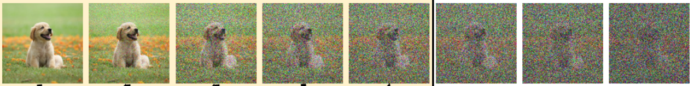
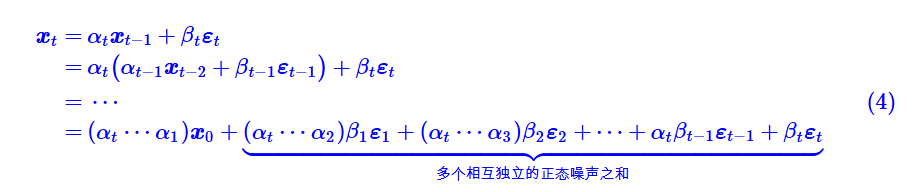
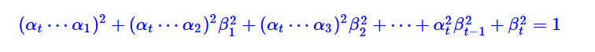
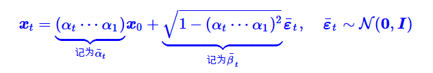

# 原理介绍
声明：本讲稿的内容来自于苏剑林的博客https://spaces.ac.cn/archives/9119，本人在博客的内容上添加了一些自己的理解和解释。但大部分数学推导都完全复制博客。本讲稿仅用于北京大学AI基础上机课教育目的。

## 1. 什么是去噪生成模型？
在本周正式课程中，老师介绍了GAN这个生成模型。回顾一下，GAN的生成思路是，有一个生成器，一个打分器；生成器的目的是生成看起来像真实数据的样本，打分器的目的是衡量生成样本的真实性。

去噪生成模型（Denoising Generative Model）是一种通过逐步去除数据中的“噪声”来生成新样本的机器学习模型。它的核心思想是：先对数据添加噪声（破坏原始信息），再训练模型逆转这一过程，最终学会从随机噪声中恢复出有意义的数据。
有时候它又叫做扩散模型。我们先不纠结“去噪”“扩散”等词汇。



## 2. 一个直观的想法？
假设我们有一张真实的图片，称为$x_0$。我们往上面加一点点高斯噪声：

$$x_1 = \alpha_1 x_0 + \beta_1 \epsilon_1$$

其中$\epsilon_1$是高斯噪声，$\alpha_1$和$\beta_1$是两个参数，控制噪声的强度，满足$\alpha_1^2 + \beta_1^2 = 1$。其中$\alpha_1$是一个非常接近于1的正数，$\beta_1$是一个非常接近于0的正数。此时$x_1$看上去跟$x_0$还是有点像的，但是已经能看出有一些噪声了。如果我们能训练一个模型，能够在给定$x_1$的情况下，预测$x_0$上面加了多少噪声，那么就可以用这个模型来预测噪声大小，然后从$x_1$中去除噪声。

具体的训练过程如下：

（1）设计一个神经网络$f_{\theta}(x)$，Loss函数为：$MSE(f_{\theta}(x_1), \epsilon_1)$。

（2）用设计的网络生成$x_0$，生成方式为：$x_0 = \frac{1}{\alpha_1} (x_1 - \beta_1 \times f_{\theta}(x_1))$

现在，如果我们有很多很多$x_1$这种，在原图上加了一点点噪声的图片，我们就能用$f_{\theta}(x)$来预测出噪声的大小，然后用这个噪声去除掉噪声，生成出真实的、无噪声的图片$x_0$。

但是问题在于，我们说的$x_1$，都是有原图的情况下，加噪声得到的，我们不可能无中生有$x_1$。

那我们能无中生有什么呢？回想起GAN里面，GAN里面一个训练好的生成器，是如何生成图片的呢？答案是，生成器从一个随机噪声作为输入，通过神经网络，直接生成一张真实图片。这告诉我们，随机噪声是可以无中生有出来的！

那现在，我们在往上看，$x_1$是加了一点噪声得到的；如果我们再往$x_1$上再加点噪声呢？是不是看上去就更像一个随机噪声了呢？

$x_2 = \alpha_2 x_1 + \beta_2 \epsilon_2$

$x_3 = \alpha_3 x_2 + \beta_3 \epsilon_3$

……

$x_t = \alpha_t x_{t-1} + \beta_t \epsilon_t$

当t趋于无穷大时，$x_t$会变得越来越像一个随机噪声。我们设定一个标准，比如说当t=1000的时候，$x_t$已经非常像一个随机噪声了，比如就是一个噪声z~N(0,1)。
然后我们可以训练1000个神经网络$f_{\theta_t}(x)$，每个网络都用$x_t$作为输入，预测出$x_{t-1}$上增加的噪声大小$\epsilon_t$。

其中第i个网络具体的训练过程如下：

（1）设计一个神经网络$f_{\theta_i}(x)$，Loss函数为：$MSE(f_{\theta_i}(x_i), \epsilon_i)$。

（2）用设计的网络生成$x_0$，生成方式为：$x_{i-1} = \frac{1}{\alpha_i} (x_i - \beta_i \times f_{\theta_i}(x_i))$

那么生成的时候，我们就可以非常简单的，先采样一个随机噪声z~N(0,1)，让$x_t$=z，然后依次调用这1000个训练好的模型，不断地去噪，直到得到$x_0$。

但是这样做问题非常大啊，我要训练1000个神经网络！！！然后要去噪1000次，这太慢了！能不能更快一点？

当然有，买一块更好的GPU，能让你训练更快，去噪更快。

如果我没那么多钱怎么办？

## 3. 更快速的训练方法

我们其实没必要学1000个网络嘛。这1000个网络的结构都是一样的，输入的都是一个加噪的图片，输出的都是噪声大小，区别就是加噪声的程度不同，那我们把加噪声的程度也当做输入，交给网络，不就可以让一个网络去学习不同程度的噪声？然后一个网络就能完成1000步去噪了，这不就省了1000倍训练时间了吗？

具体的训练过程如下：

（1）设计一个神经网络$f_{\theta}(x, t)$，Loss函数为：$MSE(f_{\theta}(x, t), \epsilon_t)$。

（2）用设计的网络生成$x_0$，生成方式为：$x_{t-1} = \frac{1}{\alpha_t} (x - \beta_t \times f_{\theta}(x_t, t))$

这样一来，我们只需要给一张图片，加噪声1000次，得到$x_1,x_2···x_{1000}$，然后用这1000张图片，训练上面说的$f_{\theta}(x, t)$网络。

```
## 训练过程
x_array = np.zeros((1001, 28, 28)) # 存放1000张图片，分辨率是28*28
x_array[0] = x_0 # 第一张图片
noise_array =np.zeros((1001, 28, 28)) # 存放1000张图片的噪声
for t in range(1, 1001):
    noise = torch.randn(28, 28) # 随机噪声
    x_array[t] = \alpha_t * x_array[t-1] + \beta_t * noise # 加噪
    noise_array[t] = noise # 噪声大小

for t in range(1, 1001):
    x_t = x_array[t]
    pred_noise = f(x_t, t) # 预测噪声大小
    Loss = MSE(pred_noise, noise_array[t]) # 计算Loss
    optimizer.zero_grad() # 梯度清零
    Loss.backward() # 反向传播

## 生成过程
z = torch.randn(28, 28) # 采样一个随机噪声
x = z
for t in range(1, 1001):
    pred_noise = f(x, t) # 预测噪声大小
    x = (1/alpha_t) * (x - beta_t * pred_noise) # 去噪
print(x_t) # 得到无噪声的图片
```

但是这样还是有问题，每张图片都要加噪1000次才能开始训练，太慢了！
有没有更快的方案？
有的有的。

## 4. 如何更快地加噪声？

我们现在是从$x_0$出发，慢慢加**小**噪声到$x_t$，那为什么不能一步登天，直接给$x_0$加个**大**噪声，得到$x_t$呢？

回想这些式子：

$x_1 = \alpha_1 x_0 + \beta_1 \epsilon_1$

$x_2 = \alpha_2 x_1 + \beta_2 \epsilon_2$

$x_3 = \alpha_3 x_2 + \beta_3 \epsilon_3$

……

$x_t = \alpha_t x_{t-1} + \beta_t \epsilon_t$

我们用一点点高中数学中数列的方法，把上面这么多个式子合起来。


我们再用一点点概率论的知识：多个独立同分布的高斯噪声之和，等于一个均值为这些高斯分布均值之和、方差为这些高斯分布方差之和的一个新的高斯分布。也就是说花括号中的内容，实际上等于均值为0，方差为:

$(\alpha_t \alpha_{t-1}····\alpha_2)^2 \beta_1^2+ (\alpha_t \alpha_{t-1}····\alpha_3)^2 \beta_2^2 + ··· + \alpha_t^2 \beta_{t-1}^2 + \alpha_{t-1}^2 \beta_t^2$

我们又注意到$\alpha_t^2 + \beta_t^2 = 1$。可以得到


那么




这意味着，我们可以从一个真实样本$x_0$出发，添加一个非常大幅度的噪声，得到一个$x_t$，然后用$f_{\theta}(x_t, t)$来预测出噪声的大小，然后用这个噪声去除掉噪声，生成出真实的、无噪声的图片$x_0$。

```
## 训练过程

for idx in range(K):
    x_0 = sample_real_image() # 采样真实图片
    t = torch.randint(1, T, (1,)) # 随机选择一个时间点
    epsilon_t = torch.randn(28, 28) # 随机噪声
    x_t = bar_alpha_t * x_0 + bar_beta_t * epsilon_t # 加噪
    pred_noise = f(x_t, t) # 预测噪声大小
    Loss = MSE(pred_noise, epsilon_t) # 计算Loss
    optimizer.zero_grad() # 梯度清零
    Loss.backward() # 反向传播
    optimizer.step() # 更新参数

## 生成过程

z = torch.randn(28, 28) # 采样一个随机噪声
x = z
for t in range(1, T):
    pred_noise = f(x, t) # 预测噪声大小
    x = (1/bar_alpha_t) * (x - bar_beta_t * pred_noise) # 去噪
print(x_t) # 得到无噪声的图片
```

## 5. 补充和说明

上面的关于DDPM的解释并非完全与DDPM原论文和苏剑林博客一致，省略、跳过了一些复杂的过程，仅保留其思想和最基础的推导。因此会存在一些错误，推荐对这个感兴趣的同学阅读原论文和苏剑林的博客。

去噪生成模型已经在多个领域表现出强大的对数据分布的建模能力，包括但不限于图片生成、音频生成、机器人动作生成等等。目前，去噪生成模型是非常热门的研究领域，包括但不限于采样加速、推理加速、不同领域应用、生成质量提升、噪声尺度、加噪方式等等研究方向。

这玩意不是AI基础，是AI前沿.jpg