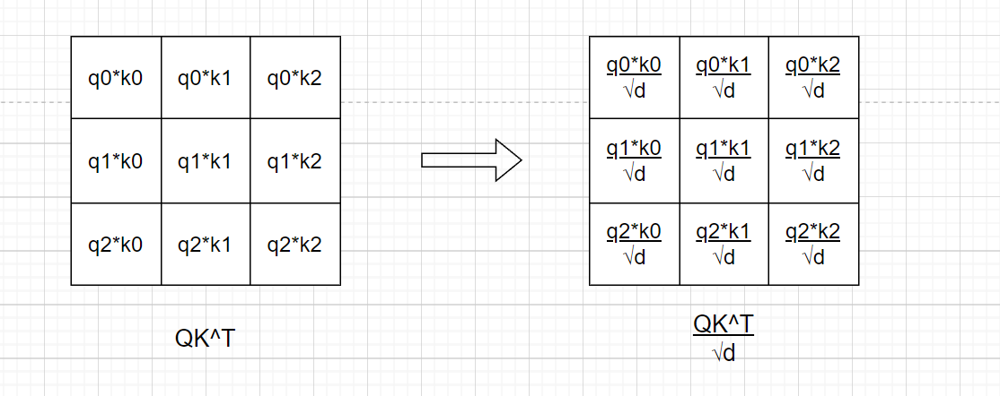

## 计算细节


我们考虑一个简单的句子，假设句子含有3个单词（简单视为3个token），那么这个句子可以被表示为$x=[x_0^T,x_1^T,x_2^T]^T$，其中$x_i$表示第i个单词的embedding，是行向量。此时$x$是一个3行d列的矩阵（d是embedding的维度，不妨令d=4）。

经过投射，$Q=W^q x$，$K=W^k x$，$V=W^v x$，其中W是权重矩阵，$W^q,W^k,W^v$分别是Q、K、V的权重矩阵。其中Q、K、V的形状跟x一样，都是3行4列的矩阵。
令$K=[k_0^T,k_1^T,k_2^T]^T$, $Q=[q_0^T,q_1^T,q_2^T]^T$, $V=[v_0^T,v_1^T,v_2^T]^T$，其中

### QK^T的计算


### 除以根号d


### softmax的计算

这里的问题在于，哪些向量做softmax?

好的，我们来看一下Softmax函数如何应用于图中右侧那个 3x3 的 QKᵀ 矩阵。

这个 3x3 矩阵包含了原始的注意力分数，我们把它记作 S：

```
      k0     k1     k2
q0 [ q0*k0  q0*k1  q0*k2 ]
q1 [ q1*k0  q1*k1  q1*k2 ]
q2 [ q2*k0  q2*k1  q2*k2 ]
```

Softmax 的目的是将这些原始分数转换成概率分布，表示每个 Query (q) 对所有 Key (k) 的注意力权重。关键在于，Softmax 是**按行（row-wise）**独立计算的。因为每一行代表一个特定的 Query (qᵢ) 与所有 Key (k₀, k₁, k₂) 的匹配程度，我们需要将这些匹配程度转换为该 Query 对所有 Key 的注意力分配（总和为1）。

**计算过程如下：**

1.  **对第一行 (q0) 应用 Softmax:**
    * 取出第一行的分数：`[s₀₀, s₀₁, s₀₂] = [q0*k0, q0*k1, q0*k2]`
    * 计算每个分数的指数：`e^(s₀₀), e^(s₀₁), e^(s₀₂)`
    * 计算该行所有指数的总和：`Sum₀ = e^(s₀₀) + e^(s₀₁) + e^(s₀₂)`
    * 计算第一行每个元素的 Softmax 值（即注意力权重）：
        * `w₀₀ = e^(s₀₀) / Sum₀`
        * `w₀₁ = e^(s₀₁) / Sum₀`
        * `w₀₂ = e^(s₀₂) / Sum₀`
    * 注意：`w₀₀ + w₀₁ + w₀₂ = 1`

2.  **对第二行 (q1) 应用 Softmax:**
    * 取出第二行的分数：`[s₁₀, s₁₁, s₁₂] = [q1*k0, q1*k1, q1*k2]`
    * 计算每个分数的指数：`e^(s₁₀), e^(s₁₁), e^(s₁₂)`
    * 计算该行所有指数的总和：`Sum₁ = e^(s₁₀) + e^(s₁₁) + e^(s₁₂)`
    * 计算第二行每个元素的 Softmax 值：
        * `w₁₀ = e^(s₁₀) / Sum₁`
        * `w₁₁ = e^(s₁₁) / Sum₁`
        * `w₁₂ = e^(s₁₂) / Sum₁`
    * 注意：`w₁₀ + w₁₁ + w₁₂ = 1`

3.  **对第三行 (q2) 应用 Softmax:**
    * 取出第三行的分数：`[s₂₀, s₂₁, s₂₂] = [q2*k0, q2*k1, q2*k2]`
    * 计算每个分数的指数：`e^(s₂₀), e^(s₂₁), e^(s₂₂)`
    * 计算该行所有指数的总和：`Sum₂ = e^(s₂₀) + e^(s₂₁) + e^(s₂₂)`
    * 计算第三行每个元素的 Softmax 值：
        * `w₂₀ = e^(s₂₀) / Sum₂`
        * `w₂₁ = e^(s₂₁) / Sum₂`
        * `w₂₂ = e^(s₂₂) / Sum₂`
    * 注意：`w₂₀ + w₂₁ + w₂₂ = 1`

**结果：**

经过 Softmax 处理后，我们会得到一个新的 3x3 矩阵，通常称为**注意力权重矩阵 (Attention Weight Matrix)**，我们记作 W：

```
      k0     k1     k2
q0 [  w₀₀    w₀₁    w₀₂  ]
q1 [  w₁₀    w₁₁    w₁₂  ]
q2 [  w₂₀    w₂₁    w₂₂  ]
```

在这个矩阵 W 中：
* 每一行代表一个 Query 的注意力分布。
* 每一行的元素之和为 1。
* 每个元素 `wᵢⱼ` 表示 Query `i` 对 Key `j` 分配的注意力权重（一个0到1之间的值）。值越大，表示 Query `i` 在生成其输出时，应该越多地关注 Key `j` 对应的 Value `vⱼ`。

**补充说明:** 在实际的 Transformer 实现中，计算 QKᵀ 后、应用 Softmax 之前，通常还有一个**缩放 (Scaling)** 步骤，即将 QKᵀ 矩阵中的每个元素除以 `sqrt(d_k)`（其中 `d_k` 是 Key 向量的维度）。这个缩放有助于防止点积结果过大，从而避免 Softmax 函数进入梯度非常小的区域，使训练更稳定。但 Softmax 的应用方式（按行计算）是不变的。

### 加权结果的计算

好的，在计算出注意力权重矩阵 W 之后，下一步就是用这些权重来对 Value (V) 矩阵进行加权求和，得到最终的注意力输出。

这个过程是通过**矩阵乘法**完成的。

我们回顾一下：

1.  **注意力权重矩阵 (W):** 这是 Softmax 的输出，一个 `n x n` 的矩阵（在我们的例子中是 3x3），其中 `n` 是序列的长度。`W[i, j]` 代表 Query `i` 对 Key `j` 的注意力权重。
    ```
          k0     k1     k2
    q0 [  w₀₀    w₀₁    w₀₂  ]
    q1 [  w₁₀    w₁₁    w₁₂  ]
    q2 [  w₂₀    w₂₁    w₂₂  ]
    ```
    (每一行和为 1)

2.  **Value 矩阵 (V):** 这个矩阵是从原始输入 X 转换而来的，包含了每个位置的 "值" 或 "内容" 表示。它是一个 `n x d_v` 的矩阵，其中 `n` 是序列长度，`d_v` 是每个 Value 向量的维度。
    ```
       [ --- v₀ --- ]   (维度 d_v)
    V= [ --- v₁ --- ]
       [ --- v₂ --- ]
    ```
    (v₀, v₁, v₂ 分别是与 k₀, k₁, k₂ 对应的 Value 向量)

**加权求和的乘法操作：**

将注意力权重矩阵 W 与 Value 矩阵 V 进行标准的矩阵乘法：

**Output = W @ V** (或者写作 **Output = W * V**)

**具体计算过程：**

* **输出矩阵的第一行 (对应 q₀ 的输出):**
    * 这一行是通过 W 的第一行 `[w₀₀, w₀₁, w₀₂]` 与 V 的所有行 (向量 `v₀`, `v₁`, `v₂`) 进行加权求和得到的。
    * `output₀ = w₀₀ * v₀ + w₀₁ * v₁ + w₀₂ * v₂`
    * 这是一个维度为 `d_v` 的向量。它混合了所有的 Value 向量，但 `v₀`, `v₁`, `v₂` 的贡献由权重 `w₀₀`, `w₀₁`, `w₀₂` 决定。如果 `w₀₁` 最大，那么 `output₀` 将主要包含 `v₁` 的信息。

* **输出矩阵的第二行 (对应 q₁ 的输出):**
    * 通过 W 的第二行 `[w₁₀, w₁₁, w₁₂]` 与 V 的所有行进行加权求和。
    * `output₁ = w₁₀ * v₀ + w₁₁ * v₁ + w₁₂ * v₂`
    * 这也是一个维度为 `d_v` 的向量。

* **输出矩阵的第三行 (对应 q₂ 的输出):**
    * 通过 W 的第三行 `[w₂₀, w₂₁, w₂₂]` 与 V 的所有行进行加权求和。
    * `output₂ = w₂₀ * v₀ + w₂₁ * v₁ + w₂₂ * v₂`
    * 这同样是一个维度为 `d_v` 的向量。

**结果：**

最终得到的 Output 矩阵是一个 `n x d_v` 的矩阵（在我们的例子中是 3 x `d_v`）：

```
         [ --- output₀ --- ]
Output = [ --- output₁ --- ]
         [ --- output₂ --- ]
```

这个 Output 矩阵就是自注意力层的最终输出。它的每一行 `outputᵢ` 是对应输入位置 `i` 的新的表示，这个新的表示通过考虑（"注意"到）输入序列中所有位置的值 (V)，并根据 Query `i` 与各个 Key `j` 的相关性 (W) 来加权组合这些值而得到。