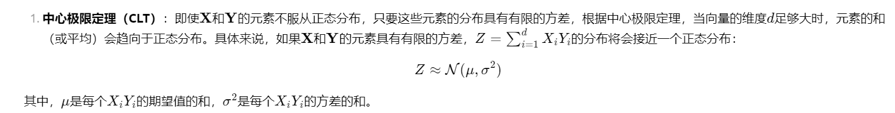

# 为什么Transformer的Attention中softmax的除以根号d？
本次内容来自于苏剑林的博客https://spaces.ac.cn/archives/9812，本人在博客的内容上添加了一些自己的理解和解释。但大部分数学推导都完全复制博客。本讲稿仅用于北京大学AI基础上机课教育目的。

## 第一种解释（PPT）

除以根号d可以让softmax的结果更加平滑，防止出现softmax的输出趋于0或1的情况。

## 第二种解释

除以根号d可以让softmax之前的向量元素服从一个正态分布，从而使得softmax的输出更加稳定。

我们看上图中最右侧的一个格子，$q_i*k_j$。
$q_i$和$k_j$都是向量，他们的维度都是d。我们假设$q_i$和$k_j$中的每个元素都服从标准正态分布，那么

$$q_i*k_j=\sum_{t=1}^d q_{it}*k_{jt}$$

其中$q_{it}$和$k_{jt}$是$q_i$和$k_j$的第$t$维元素。

因此这个格子里面的数值，相当于d个正态分布的乘积。

所以除以根号d，相当于让每个元素都除以根号d，使得每个元素都服从一个标准正态分布。在这个标准正态分布中，softmax的输出更加稳定(因为有97%的概率，数值会落在正负2个标准差之内)。

## 第三种解释

太难了，不想讲了。。。自己看苏剑林老师博客吧
https://spaces.ac.cn/archives/9812