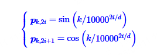
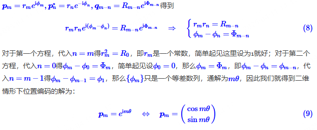
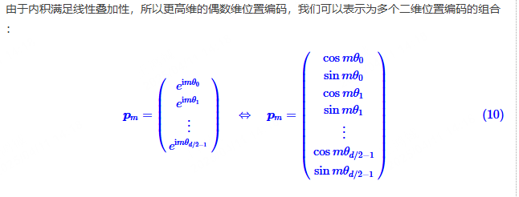
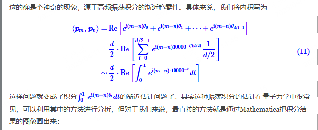
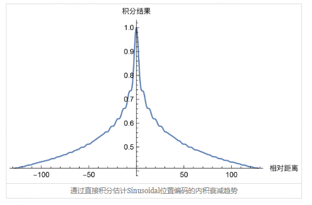
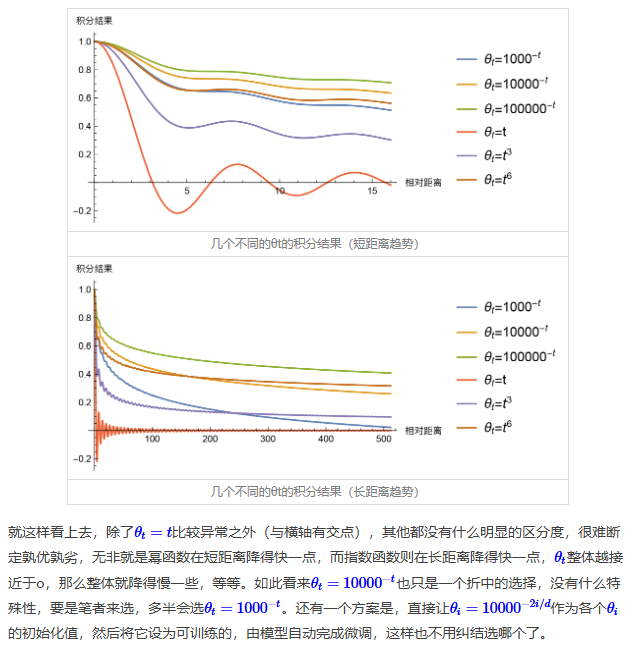

# Transformer里面的位置编码是什么？
我们假设有一个句子矩阵$x$，是一个N行D列的矩阵，N是句子的token数目，D是embedding 维度，$F(x)$也是一个N行D列的矩阵。

我们为第$k$行、第$2i$列（或者第$2i+1$列）添加如下位置编码，其中$i=0,1,2....\frac{d}{2}-1$

最终结果就是$x'_{k,j}=x_{k,j}+p_{k,j}$

注意到，位置编码跟某个单词（也就是某一行embedding）强相关，这意味着这个单词在不同行出现，添加上的位置编码是完全不同的。

比如对这个句子: Can you open a can? (你能打开一个罐头吗？)，两个"can"在词嵌入的时候，都是相同的embedding，但是由于位置不同，所以加上的位置编码不同，因此就会有一些差异（体现在语义上就是词性和表达的意思不同）。

可以浅薄地认为，位置编码反应了这个单词的不同词性、多义词等等。

# 为什么需要位置编码？

上面这个例子其实就很明显了，一个同样的单词在不同的位置，意思其实不一样。我们需要用一些手段来表示这种不一样。

问题在于，为什么添加$sin$和$cos$？有没有其他更好的位置编码方案？

以下内容主要来自苏剑林的博客：https://www.spaces.ac.cn/archives/8231。
在引用Block内的是个人理解。

假设我们的模型为$f(\cdots, \boldsymbol{x}_m, \cdots, \boldsymbol{x}_n, \cdots)$，其中标记出来的$\boldsymbol{x}_m, \boldsymbol{x}_n$分别表示第$m, n$个输入，**不失一般性**，设$f$是标量函数。对于不带 Attention Mask 的纯 Attention 模型，它是**全对称**的，即对于任意的$m, n$，都有：

>$f$理论上应该是输入一个向量/矩阵，输出一个向量/矩阵，在这里说它是标量函数的意思是，输出的向量/矩阵仅仅考虑数值意义上。比如[1,2,0,-2]的softmax结果和[2,1,0,-2]的softmax数值结果一致，但是排列顺序不同。对于Self-Atten或FFN而言，排列顺序不同并不会影响后续的过程。后续过程可以是类似于BERT的CLS token或者说GPT 的Next Token Prediction任务。
> 
> 所以说它是全对称的。

$$
f(\cdots, \boldsymbol{x}_m, \cdots, \boldsymbol{x}_n, \cdots) = f(\cdots, \boldsymbol{x}_n, \cdots, \boldsymbol{x}_m, \cdots) \tag{2}
$$

这就是我们说 Transformer 无法识别位置的原因——**全对称性**。简单来说就是函数天然满足恒等式$f(\boldsymbol{x}, \boldsymbol{y}) = f(\boldsymbol{y}, \boldsymbol{x})$，以至于我们无法从结果上区分输入是$[\boldsymbol{x}, \boldsymbol{y}]$还是$[\boldsymbol{y}, \boldsymbol{x}]$。

因此，我们要做的位置编码，就是要**打破这种对称性**，比如在每个位置上都加上一个不同的位置向量：

$$
f(\cdots, \boldsymbol{x}_m + \boldsymbol{p}_m, \cdots, \boldsymbol{x}_n + \boldsymbol{p}_n, \cdots) \neq f(\cdots, \boldsymbol{x}_n + \boldsymbol{p}_m, \cdots, \boldsymbol{x}_m + \boldsymbol{p}_n, \cdots) \tag{3}
$$

一般来说，如果位置编码向量的量不同，那么这对称性就被破坏掉了，即可以用于“告诉模型”有序的输入。但是我们希望能进一步分析位置编码的性质，甚至得到一个显式式子，那么就不能止步于此。

为了简化问题，我们先只考虑$x_m$这两个位置上的位置编码，将它当作扰动项，泰勒展开到二阶：

$$
\tilde{f} \approx f + \boldsymbol{p}_m^\top \frac{\partial f}{\partial \boldsymbol{x}_m} + \boldsymbol{p}_n^\top \frac{\partial f}{\partial \boldsymbol{x}_n} 
+ \frac{1}{2} \boldsymbol{p}_m^\top \frac{\partial^2 f}{\partial \boldsymbol{x}_m^2} \boldsymbol{p}_m 
+ \frac{1}{2} \boldsymbol{p}_n^\top \frac{\partial^2 f}{\partial \boldsymbol{x}_n^2} \boldsymbol{p}_n 
+ \boldsymbol{p}_m^\top \frac{\partial^2 f}{\partial \boldsymbol{x}_m \partial \boldsymbol{x}_n} \boldsymbol{p}_n 
\\= f + \boldsymbol{p}_m^\top \boldsymbol{H}_{\boldsymbol{x}_m} + \boldsymbol{p}_n^\top \boldsymbol{H}_{\boldsymbol{x}_n} 
+ \frac{1}{2} \boldsymbol{p}_m^\top \boldsymbol{H}_{\boldsymbol{x}_m \boldsymbol{x}_m} \boldsymbol{p}_m 
+ \frac{1}{2} \boldsymbol{p}_n^\top \boldsymbol{H}_{\boldsymbol{x}_n \boldsymbol{x}_n} \boldsymbol{p}_n 
+ \boldsymbol{p}_m^\top \boldsymbol{H}_{\boldsymbol{x}_m \boldsymbol{x}_n} \boldsymbol{p}_n \tag{4}
$$

可以看到，第 1 项跟位置无关，第 2 到第 5 项都只依赖于单一位置，所以它们是纯粹的**单点位置信息**，第 6 项是**同时依赖$\boldsymbol{p}_m, \boldsymbol{p}_n$的交互项**，我们将它记为$\boldsymbol{p}_m^\top \boldsymbol{H}_{\boldsymbol{x}_m \boldsymbol{x}_n} \boldsymbol{p}_n$，它是表达**某一对特定位置之间的关系**的重要部分。

简单起见，不妨假设$\boldsymbol{H}_{\boldsymbol{x}_m \boldsymbol{x}_n}$是一个单位矩阵。

>为什么可以这样假设呢？其实实践上并不一定是单位矩阵，但是我们先这样做，便于后续分析。

于是表达特定位置关系：
$\boldsymbol{p}_m^\top \boldsymbol{H}_{\boldsymbol{x}_m \boldsymbol{x}_n} \boldsymbol{p}_n=\boldsymbol{p}_m^\top  \boldsymbol{p}_n=<\boldsymbol{p}_m,\boldsymbol{p}_n>$。

我们希望表达位置关系的意思是，找到一个g函数，使得$g(m-n)=<p_m,p_n>$

简单起见，我们假设$p_m$和$p_n$都是二维的。在这种情况下，$p_m$和$p_n$的内积用复数表达就是$<p_m,p_n>=Re[\bar{p_m}p_n]$

我们也可以再设一个复数$q_{m-n}=\bar{p_m}p_n$。这样两边取实部，就可以得到上面说的g函数。

然后把这个$q_{m-n}$按如下方式解出来：

>上面这个解的过程，很有意思。有意思的点在于，这里带了一股“旋转”的味道。一个词嵌入，加上了一个代表旋转角度的向量，就能表达不同位置的向量了。这里可能会有一个问题是，单词A的词嵌入加上一个代表旋转角度的向量之后，会不会变成单词B的词嵌入向量。也就是$x_a+p_k=x_b$。比如单词"can"加完位置编码之后，变成了单词"man"的词嵌入？其实概率很低，因为在高维空间中，2个随机向量有极大的概率是垂直的（一个简单的证明放在最末），因此一些小的扰动很难让词向量重叠。

到了这里，其实sin cos位置编码的样子已经要出来了。接下来就是确定这里的$\theta$取多少比较合适。

什么样的$\theta$是一个好的？我们秉持一种原则：两个单词隔的越远，互相影响就越低。
也就是说随着$|m-n|$增大，$<p_m,p_n>$应该趋近于0。

但我们说这里$p_m$和$p_n$都是三角函数，他们是周期的，怎么会趋近于0呢？这其实源自于高频振荡积分的渐近趋零性。

> 我们还是把这个性质的证明放到最后。

如果我们取$\theta_{t}=10000^{-t}$，那么图像如下：

可以发现这样确实能满足我们的需求

一些其它$\theta_{t}$的结果：

## 万一H矩阵不是单位阵呢？

我们再放宽一些，H是对角矩阵。

类似的结果也能被推导出来。请见苏剑林博客原内容。

## 补充

### 高维向量大概率垂直
为了证明在高维空间中两个随机向量的概率极大是垂直的，我们可以使用概率论和向量空间的概念。以下是一个简化的证明过程：

#### 步骤1：定义问题
考虑两个在单位超球面上均匀分布的随机向量$\mathbf{u}$和$\mathbf{v}$，在$d$维空间中。

#### 步骤2：内积的期望和方差

- **内积的期望**：
  由于$\mathbf{u}$和$\mathbf{v}$在单位球面上均匀分布，他们的内积$\langle \mathbf{u}, \mathbf{v} \rangle$的期望值为：
 $$
  \mathbb{E}[\langle \mathbf{u}, \mathbf{v} \rangle] = 0
 $$
  这是因为内积的对称性和分布的均匀性。

- **内积的方差**：
  利用向量的长度限制和维度$d$，可以推导出：
 $$
  \mathrm{Var}(\langle \mathbf{u}, \mathbf{v} \rangle) = \frac{1}{d}
 $$
  这是因为在高维空间中，向量的分量几乎是独立的，因此方差会随着维度的增加而减小。

#### 步骤3：使用大数定律

当维度$d$非常大时，根据大数定律，$\langle \mathbf{u}, \mathbf{v} \rangle$将集中在其期望值附近。由于期望值为0，方差为$\frac{1}{d}$，因此：

$$
\langle \mathbf{u}, \mathbf{v} \rangle \approx \mathcal{N}(0, \frac{1}{\sqrt{d}})
$$

#### 步骤4：垂直性的概率

- 垂直意味着$\langle \mathbf{u}, \mathbf{v} \rangle = 0$。但在高维空间中，我们考虑的是接近于垂直的情况，即内积接近于0。

- 由于$\langle \mathbf{u}, \mathbf{v} \rangle$服从近似正态分布，随着$d$的增大，$\langle \mathbf{u}, \mathbf{v} \rangle$接近于0的概率越来越大。

- 具体地，可以使用切比雪夫不等式（Chebyshev's inequality）来估计这个概率：
 $$
  P(|\langle \mathbf{u}, \mathbf{v} \rangle| > \epsilon) \leq \frac{\mathrm{Var}(\langle \mathbf{u}, \mathbf{v} \rangle)}{\epsilon^2} = \frac{1}{d\epsilon^2}
 $$
  当$d \to \infty$，这个概率趋近于0，意味着$\langle \mathbf{u}, \mathbf{v} \rangle$几乎总是接近于0。

#### 结论

在高维空间中，随着维度$d$的增大，两个随机向量几乎总是近似垂直，因为它们之间的内积趋近于0。这是一个非正式的证明，展示了高维空间中向量垂直性的直观理解。实际应用中，可以通过数值模拟进一步验证这个现象。

### 高频振荡积分的渐近趋零性
当然可以。让我们用数学语言来描述高频振荡积分的渐近趋零性。

假设我们有一个函数$f(t)$, 它代表一个高频振荡信号。该信号可以表示为：

$$f(t) = A \cos(\omega t + \phi)$$

其中：

$A$是振幅，

$\omega$是角频率（与频率$f$的关系为$\omega = 2\pi f$），

$\phi$是相位。

当我们对这个高频振荡函数进行积分时，我们看的是：

$$I(t) = \int_0^t f(\tau) \, d\tau$$

对于高频振荡信号$f(t)$，这个积分通常不会直接趋向于零，因为振荡会让积分结果在正负之间来回变化。但是，当我们考虑长期行为或平均行为时，情况就有所不同了。

#### 渐近行为的数学描述

为了描述渐近趋零性，我们可以考虑以下几个方面：

1. **平均值**：如果我们计算$I(t)$在时间区间$[0, T]$内的平均值：

$$\frac{1}{T} \int_0^T I(t) \, dt = \frac{1}{T} \int_0^T \left( \int_0^t f(\tau) \, d\tau \right) dt$$

当$T$非常大时，由于$f(t)$是高频振荡的，内部积分的贡献在长时间尺度上会相互抵消，使得这个平均值趋近于零：

$$\lim_{T \to \infty} \frac{1}{T} \int_0^T I(t) \, dt = 0$$

2. **周期性和振幅衰减**：如果我们考虑$f(t)$的周期性和振幅的衰减（这在实际物理系统中常见），我们可以引入一个衰减因子$e^{-\alpha t}$，使得：

$$f(t) = A e^{-\alpha t} \cos(\omega t + \phi)$$

积分后，$I(t)$的形式会包含一个衰减指数因子：

$$I(t) \propto \frac{A}{\alpha^2 + \omega^2} e^{-\alpha t} \left( \alpha \cos(\omega t + \phi) + \omega \sin(\omega t + \phi) \right)$$

当$t$趋向于无穷大时，由于$e^{-\alpha t}$的存在，$I(t)$会指数衰减到零：

$$\lim_{t \to \infty} I(t) = 0$$

这展示了高频振荡函数在积分后，随着时间的推移，其贡献会逐渐趋向于零的现象。需要注意的是，这种渐近趋零性并不意味着积分值在任何有限时间内都为零，而是指在长时间尺度上，积分的结果会变得越来越接近于零。